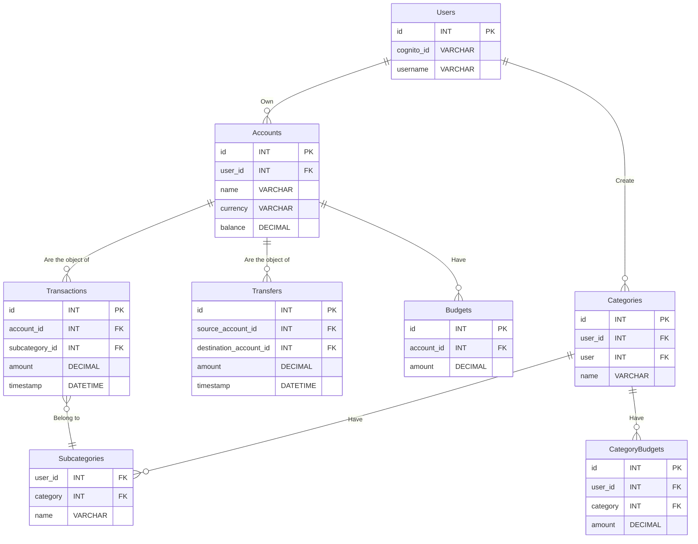

<!-- Write an ER diagram using mermaid.js -->

## ER Diagram

```mermaid
erDiagram
    Users ||--o{ Accounts : Own
    Accounts ||--o{ Transactions : "Are the object of"
    Accounts ||--o{ Transfers : "Are the object of"
    Accounts ||--o{ Budgets : "Have"
    Users ||--o{ Categories : Create
    Categories ||--o{ Subcategories : Have
    Categories ||--o{ CategoryBudgets : Have
    Transactions }o--|| Subcategories : "Belong to"

    Users {
        id INT PK
        cognito_id VARCHAR
        username VARCHAR
    }

    Accounts {
        id INT PK
        user_id INT FK
        name VARCHAR
        currency VARCHAR
        balance DECIMAL
    }

    Transactions {
        id INT PK
        account_id INT FK
        subcategory_id INT FK
        amount DECIMAL
        timestamp DATETIME
    }

    Transfers {
        id INT PK
        source_account_id INT FK
        destination_account_id INT FK
        amount DECIMAL
        timestamp DATETIME
    }

    Budgets {
        id INT PK
        account_id INT FK
        amount DECIMAL
    }

    Categories {
        id INT PK
        user_id INT FK
        user INT FK
        name VARCHAR
    }

    Subcategories {
        user_id INT FK
        category INT FK
        name VARCHAR
    }


    CategoryBudgets {
        id INT PK
        user_id INT FK
        category INT FK
        amount DECIMAL
    }

```
